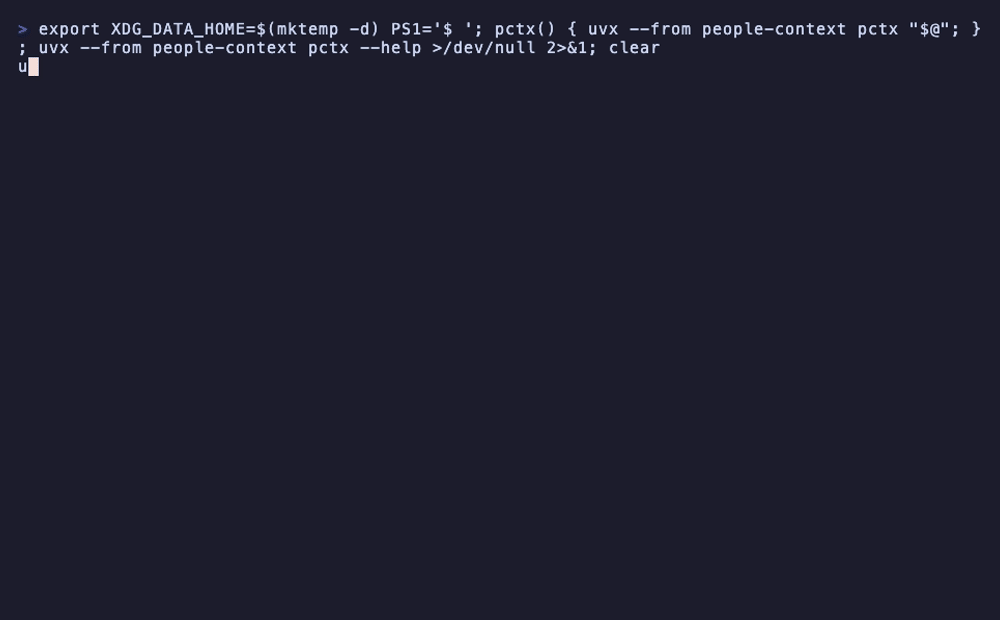

# people-context

<!-- mcp-name: io.github.jinyangwang27/people-context -->

**Your agent already remembers your codebase. Now it can remember your people.**

`people-context` is a local-first [MCP](https://modelcontextprotocol.io) server and CLI that gives AI agents
durable memory about the people in your life: who someone is, how you know them, what you last agreed, and how
they like to be talked to. One SQLite file on your machine. No account, no cloud, no network calls.

[](https://github.com/JinyangWang27/people-context/actions/workflows/ci.yml)
[](https://codecov.io/gh/JinyangWang27/people-context)
[](https://scorecard.dev/viewer/?uri=github.com/JinyangWang27/people-context)
[](https://www.bestpractices.dev/projects/13681)
[](https://pypi.org/project/people-context/)
[](https://pypi.org/project/people-context/)
[](https://pypi.org/project/people-context/)
[](https://github.com/JinyangWang27/people-context/blob/main/LICENSE)



## Why

Ask an assistant "how should I approach Priya about the reporting delay?" and it has nothing: it does not know
which Priya, that she is your counterpart at a partner org, that you agreed a new deadline last week, or that she
prefers a short email over a call. That knowledge lives in your head, your inbox, and a notes file the agent
cannot see.

`people-context` keeps it in one place the agent can query through narrow tools:

- **Who is this?** Explainable name resolution over names, nicknames, aliases, and handles. Two Priyas come back
  as two candidates with a match reason, never a silent guess.
- **What do I know?** Relationships, organisations and roles, durable facts, concise interaction summaries,
  traits, reminders, and a per-person timeline, each disclosed only as far as the request needs.
- **How do I talk to them?** Communication guidance grounded in recorded traits, past friction, open follow-ups,
  and your own written philosophy.
- **Who has gone quiet?** Stale-relationship and upcoming-date reports over what is already stored.
- **Get data in safely.** Email, mbox, vCard, calendar, LinkedIn, Outlook, and WhatsApp exports are staged as
  reviewable candidates. You approve what gets recorded; raw source content is never kept.

It is opinionated about trust: writes are audited, `forget` is a real delete, sensitive records sit behind an
operator-only gate that a prompt cannot open, and ordinary commands never touch the network.

## Demo

A packaged fictional dataset is the fastest way to see identity resolution, graph traversal, and bounded
context without touching real data:

```bash
uvx --from people-context pctx demo --reset
```

The demo always writes its own dedicated database at
`{XDG_DATA_HOME or ~/.local/share}/people-context/demo.db`. It ignores `--db`, `PEOPLE_CONTEXT_DB`, the config
file, and workspace discovery, and `--reset` replaces only that file plus its `-wal`/`-shm` companions, so a
real database is never read or modified. Seeding writes audited fictional people, handles, affiliations, facts,
interactions, and a connected relationship graph, then prints the path-targeted server command and concrete
tool calls that use the ids it just created:

```text
Demo database: /home/you/.local/share/people-context/demo.db
Start MCP server: people-context-mcp --db /home/you/.local/share/people-context/demo.db
resolve_person {"query": "Amina Hassan"}
get_relationship_graph {"person_id": "<amina-id>", "depth": 2}
find_connection {"person_a": "<self-id>", "person_b": "<sofia-id>"}
```

Person ids are generated per seed, so the printed values differ from the placeholders above. Start the printed
server command in an MCP client and run the printed calls verbatim. See
[docs/cli.md](docs/cli.md#packaged-demo).

## Quick start

Requires Python 3.11+ and [`uv`](https://docs.astral.sh/uv/). Pick your client; each is one step.

<details open>
<summary><b>Claude Code</b></summary>

```bash
claude plugin marketplace add JinyangWang27/people-context
claude plugin install people-context@people-context-plugins
```

Restart Claude Code or run `/reload-plugins`. You get the server plus `/people-context:who`,
`/people-context:remember`, and `/people-context:reminders`. Details: [docs/claude-code-plugin.md](docs/claude-code-plugin.md).
</details>

<details>
<summary><b>Claude Desktop</b></summary>

Download `people-context.mcpb` from the
[latest release](https://github.com/JinyangWang27/people-context/releases/latest) and open it. Claude Desktop
installs the pinned release with its own `uv` runtime. Details: [docs/desktop-and-editors.md](docs/desktop-and-editors.md).
</details>

<details>
<summary><b>Codex</b></summary>

```bash
codex plugin marketplace add JinyangWang27/people-context
codex plugin add people-context@people-context-plugins
```

Start a new Codex session. Details: [docs/codex-plugin.md](docs/codex-plugin.md).
</details>

<details>
<summary><b>Cursor, Windsurf, VS Code, or any MCP client</b></summary>

Add the stdio server to your client's MCP config (`.cursor/mcp.json`, `~/.codeium/windsurf/mcp_config.json`,
`.vscode/mcp.json`, ...):

```json
{
  "mcpServers": {
    "people-context": {
      "command": "uvx",
      "args": ["--from", "people-context", "people-context"]
    }
  }
}
```

Or let the CLI write it: `uvx --from people-context pctx setup cursor` (also `windsurf`, `vscode`,
`claude-desktop`; add `--dry-run` to preview). VS Code uses a `servers` key with `"type": "stdio"`. Per-editor
snippets: [docs/desktop-and-editors.md](docs/desktop-and-editors.md).
</details>

<details>
<summary><b>OpenClaw</b></summary>

```bash
openclaw plugins install clawhub:openclaw-plugin-people-context
```

The native plugin talks to the opt-in loopback HTTP server. Details: [docs/openclaw-plugin.md](docs/openclaw-plugin.md).
</details>

<details>
<summary><b>CLI only</b></summary>

```bash
uv tool install people-context
pctx init        # seed your own record, optionally import a vCard, then connect a client
pctx --help
```

`people-context` and `people-context-mcp` are the server commands; `pctx` is the human-operated CLI.
</details>

Then try, in your agent:

> Who is Amina?
>
> Remember that Amina from Open City Lab prefers short emails and hates surprise calls.
>
> What should I know before my meeting with Daniel tomorrow?

The second one is a single `remember` tool call: the name is resolved, the person is created only if nobody
matches, and the affiliation and preference are recorded in one audited transaction. Ambiguous names come back
as candidates, never a guess.

Or, without an agent: `pctx remember "Amina Hassan" "prefers short emails" --org "Open City Lab"` and
`pctx brief "Amina Hassan"`. Five worked scenarios live in [docs/use-cases](docs/use-cases/README.md).

## What it remembers, and what it never does

| It remembers | It never does |
|---|---|
| Names, nicknames, aliases, and handles | Upload anything, anywhere |
| Relationships with a canonical, extensible vocabulary | Store raw imported emails, chats, or files |
| Organisations, roles, and time-bounded affiliations | Let a model enable sensitive disclosure or full export |
| Durable facts, observations, and traits with evidence | Commit imported or agent-extracted data without your review |
| Concise interaction summaries and a per-person timeline | Log private values or keep a soft-deleted copy after `forget` |
| Reminders, follow-ups, and your communication philosophy | Make a network request outside `pctx reindex --semantic` |

## How it compares

| | `people-context` | Assistant memory (ChatGPT, Claude) | Memory platforms (Mem0 and similar) |
|---|---|---|---|
| Where data lives | One SQLite file you own | Vendor account | Vendor platform or your own deployment |
| Works offline | Yes | No | Self-hosted only |
| Knows *people* as first-class records | Identity, relationships, roles, graph, guidance | Free-text notes | Free-text or vector memories |
| Explains a match | Ranked candidates with a reason; ambiguity is surfaced | No | Similarity score |
| Import review gate | Stage, review, commit | n/a | Automatic extraction |
| Deletion | Hard delete plus audit redaction in one transaction | Request to vendor | API delete |
| Backup and move | `pctx sync push` / `pull` bundle | n/a | Deployment-specific |

The dated, sourced version with vendor documentation links is in
[docs/privacy-and-safety.md](docs/privacy-and-safety.md#local-first-versus-cloud-hosted-memory-as-of-2026-08-05).

## Security model

This project executes local Python with the launching user's filesystem permissions. Ordinary MCP discovery
excludes elevated sensitive context and full export. Operator-gated tools require process environment flags;
models cannot enable them through arguments. Vault export is intentionally CLI-only.

The database is plaintext SQLite by default. On Unix-like systems a new one is created `0600`, so other local
accounts cannot read it. That is a boundary between accounts, not encryption, so pair it with full-disk
encryption or opt into SQLCipher at-rest encryption (`uv sync --extra encrypted`, key read only from
`PEOPLE_CONTEXT_DB_KEY`). See
[database file permissions](docs/privacy-and-safety.md#database-file-permissions) and
[optional at-rest encryption](docs/privacy-and-safety.md#optional-at-rest-encryption).

## Going further

- **Loopback HTTP** for clients that cannot spawn stdio: `people-context-mcp --http --host 127.0.0.1 --port 8765`.
  Unauthenticated and local-only by design; prefer stdio. See [docs/cli.md](docs/cli.md).
- **Semantic search**: `uv sync --extra semantic && pctx reindex --semantic` downloads a pinned multilingual
  Model2Vec model once; server startup and search stay cache-only.
- **Obsidian**: `pctx export-vault --output ~/PeopleVault` writes a deterministic, browsable vault, and a
  read-only [Obsidian plugin](obsidian-plugin/) renders live briefs. See [docs/obsidian-plugin.md](docs/obsidian-plugin.md).
- **Import**: `pctx import stage SOURCE PATH` then `review` and `commit`, over email, mbox, vCard, `.ics`,
  LinkedIn, Outlook, and WhatsApp exports. Agents can stage extracted candidates the same way. See
  [docs/import.md](docs/import.md).
- **Reports and maintenance**: `pctx stale`, `pctx upcoming`, `pctx timeline`, `pctx doctor`, `pctx stats`.
- **Backup and second device**: `pctx sync push --output DIR` and `pctx sync pull --input PATH`.
- **Docker**: `docker run --rm -i -v people-context-data:/data ghcr.io/jinyangwang27/people-context:latest`.
  A convenience image, not a sandbox. See [docs/docker.md](docs/docker.md).
- **Database location**: `--db`, then `PEOPLE_CONTEXT_DB`, then the XDG config file, then an OpenClaw workspace,
  then the XDG data directory. Inspect with `pctx db-path -v`.

The full command reference is in [docs/cli.md](docs/cli.md); the MCP tool inventory and response contracts are
in [docs/mcp-interface.md](docs/mcp-interface.md); what stays stable across releases is in
[docs/compatibility.md](docs/compatibility.md).

## Architecture

The codebase follows ports and adapters:

```text
adapters (SQLite, MCP, filesystem, imports, CLI)
        ↓ implement
ports (narrow Protocols)
        ↑ used by
app (use cases and policy)
        ↓ operates on
domain (entities and values)
```

Dependencies point inward. Vocabulary normalization and graph caps live in app/domain; recursive SQL and file
writing live in adapters. One composition root wires both stdio and HTTP. See
[docs/architecture.md](docs/architecture.md).

## Documentation

| Document | Contents |
|---|---|
| [docs/architecture.md](docs/architecture.md) | Layering, dependency rule, entrypoint wiring |
| [docs/data-model.md](docs/data-model.md) | Schema, migrations, and perspective `display_type` |
| [docs/relationship-graph.md](docs/relationship-graph.md) | Vocabulary, normalization, perspective, traversal, curation |
| [docs/vault-export.md](docs/vault-export.md) | Layout, marker safety, determinism, sensitivity |
| [docs/mcp-interface.md](docs/mcp-interface.md) | MCP tools and stable response contracts |
| [docs/compatibility.md](docs/compatibility.md) | What stays stable across releases for MCP, DB, CLI, and JSON |
| [docs/cli.md](docs/cli.md) | CLI commands and DB resolution |
| [docs/import.md](docs/import.md) | Import sources, staging, review, and commit |
| [docs/design/sync.md](docs/design/sync.md) | Sync design and delivered local foundations |
| [docs/releasing.md](docs/releasing.md) | PyPI trusted publishing, Codecov, and release procedure |
| [docs/mcp-registry.md](docs/mcp-registry.md) | MCP Registry namespace, `server.json`, and community-directory submission matrix |
| [docs/desktop-and-editors.md](docs/desktop-and-editors.md) | Native-UV MCPB Desktop bundle and Cursor/Windsurf/VS Code snippets |
| [docs/docker.md](docs/docker.md) | Optional non-root stdio Docker image, data volume, and GHCR publishing |
| [docs/claude-code-plugin.md](docs/claude-code-plugin.md) | Claude Code install, runtime, privacy, validation, and publishing |
| [docs/codex-plugin.md](docs/codex-plugin.md) | Codex install, runtime, privacy, validation, and publishing |
| [docs/openclaw-plugin.md](docs/openclaw-plugin.md) | OpenClaw install, runtime, privacy, validation, and ClawHub publishing |
| [docs/obsidian-plugin.md](docs/obsidian-plugin.md) | Obsidian read-only panes, subprocess safety, encryption, and mirrored releases |
| [docs/privacy-and-safety.md](docs/privacy-and-safety.md) | Disclosure, audit, forget, threat model |
| [docs/use-cases](docs/use-cases/README.md) | Narrative recipes for onboarding, meeting prep, follow-up, migration, and auditing |
| [docs/evals.md](docs/evals.md) | Evaluation harness, fixed tasks, scoring rules, and dated recorded results |
| [docs/roadmap.md](docs/roadmap.md) | Delivered milestones and planned work |
| [docs/specs](docs/specs/) | One implementation spec per planned milestone |

## Contributing

Issues and pull requests are welcome; see [CONTRIBUTING.md](CONTRIBUTING.md) for the architecture rules,
validation commands, and a list of good first issues. Questions and show-and-tell go to
[Discussions](https://github.com/JinyangWang27/people-context/discussions).

If `people-context` is useful to you, a star helps other people find it.

## License

MIT. See [LICENSE](LICENSE).
